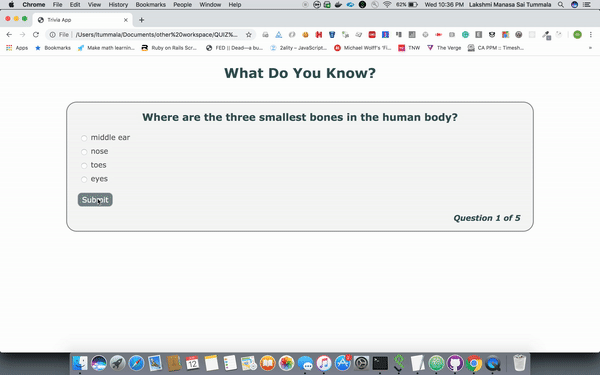

# Quiz-VanillaJS
A Quiz app with Vanilla JS

Open **index.html** in a browser to see the app

- In this application, we start a quiz with a set of **predefined questions**.
- Once the questions are answered we display the score along with the result of each question.
- In the same page, we provide an option to **retake the quiz** or **add a new question**.
- If the user chooses to add a new question, we provide a form to add the question and the four options along with the correct answer. On submit, we store the new question in the **localstorage** of the browser. Next time the quiz is taken, we display this new question along with the other questions.

## Demo

